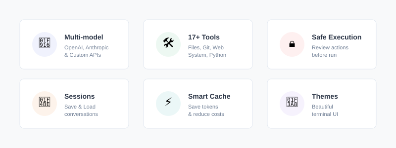
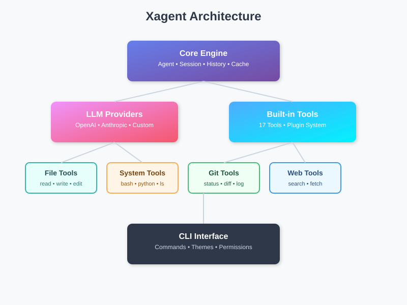
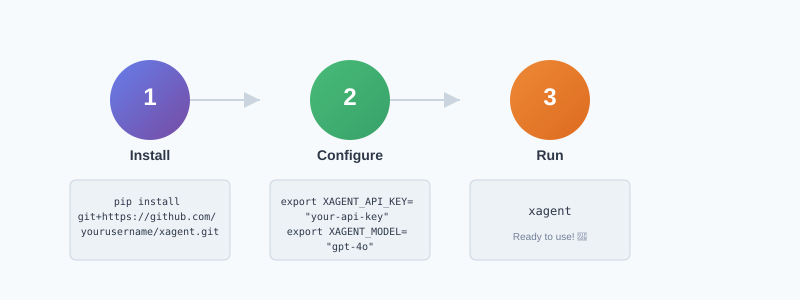
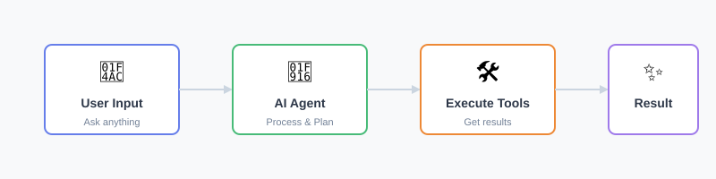

# Xagent

<div align="center">


### 🚀 A Lightweight Terminal Agent Framework

[](LICENSE)
[](https://www.python.org/)
[](CONTRIBUTING.md)

**Small but Powerful** • **Multi-model Support** • **17+ Built-in Tools** • **Extensible**

[Features](#-features) • [Quick Start](#-quick-start) • [Documentation](#-documentation) • [Contributing](#-contributing)

</div>

---

## 🎬 Demo

<div align="center">

</div>

## ✨ Features



### Why Xagent?

- **🤖 Multi-model Support** - Works with OpenAI, Anthropic, and any OpenAI-compatible API
- **🛠️ Rich Toolset** - 17+ built-in tools for files, git, web, and system operations  
- **🔒 Security First** - Permission control with diff preview before dangerous operations
- **⚡ Smart Caching** - Intelligent request caching to save tokens and reduce costs
- **💾 Session Management** - Save, load, and resume conversations seamlessly
- **🔄 Auto Session Resume** - Pick up where you left off with `/resume`
- **🎨 Beautiful CLI** - Customizable themes and intuitive interface
- **🔌 Plugin System** - Easy to extend with custom tools

## 🎯 Architecture



## 🚀 Quick Start

<div align="center">

</div>

### Prerequisites

- Python 3.12 or higher
- An API key from OpenAI or Anthropic

### Download Binary (No Python Required)

Pre-built binaries for macOS and Windows are available on the [Releases](https://github.com/JerryX-sudo/Xagent/releases) page:

| Platform | Architecture | Download |
|----------|-------------|----------|
| macOS | ARM64 (Apple Silicon) | [xagent-macos-arm64](https://github.com/JerryX-sudo/Xagent/releases/latest) |
| Windows | x86_64 | [xagent-windows-x86_64.exe](https://github.com/JerryX-sudo/Xagent/releases/latest) |

After downloading, run directly:

```bash
# macOS
chmod +x xagent-macos-arm64
./xagent-macos-arm64

# Windows
.\xagent-windows-x86_64.exe
```

### Installation (via pip)

```bash
# Using pip
pip install git+https://github.com/JerryX-sudo/Xagent.git

# Or clone and install locally
git clone https://github.com/JerryX-sudo/Xagent.git
cd Xagent
pip install -e .
```

### Configuration

#### Option 1: Environment Variables (Recommended)

```bash
# Set your API credentials
export XAGENT_API_KEY="your-api-key"
export XAGENT_MODEL="gpt-4o"  # or claude-3-opus-20240229

# Optional: custom endpoint for OpenAI-compatible APIs
export XAGENT_BASE_URL="https://api.openai.com/v1"

# Run Xagent
xagent
```

#### Option 2: Interactive Setup

Simply run `xagent` without configuration - it will guide you through setup:

```bash
$ xagent

╭──────────── Xagent Setup ────────────╮
│ Environment variables not found.     │
│ Please enter your configuration.     │
╰──────────────────────────────────────╯

API Key: ********
Base URL: [Enter for default]
Model [gpt-4o]: 

Testing connection...
✓ Connection successful!

╭─────────────────────────────────────╮
│  Welcome to Xagent! Type /help     │
│  for available commands.            │
╰─────────────────────────────────────╯

You: █
```

## 📖 Documentation

### Workflow



### Available Commands

| Command | Description | Example |
|---------|-------------|---------|
| `/help` | Show all available commands | `/help` |
| `/clear` | Clear current conversation | `/clear` |
| `/resume` | Resume a recent session (up to 3, expires in 7 days) | `/resume` |
| `/exit` or `/quit` | Exit Xagent | `/exit` |
| `/memory` | View or manage persistent memory | `/memory add "Important note"` |
| `/history` | Show conversation history | `/history` |
| `/save [name]` | Save current session | `/save my_session` |
| `/load <name>` | Load a saved session | `/load my_session` |
| `/export [name]` | Export conversation to markdown | `/export chat_log` |
| `/cache` | View or clear request cache | `/cache clear` |
| `/tools` | List all available tools | `/tools` |
| `/theme [name]` | View or change color theme | `/theme monokai` |
| `/permissions` | Manage auto-approval settings | `/permissions` |

### Built-in Tools

<details>
<summary><b>📁 File Operations</b></summary>

| Tool | Description |
|------|-------------|
| `read_file` | Read file contents with line number support |
| `write_file` | Create or overwrite files with diff preview |
| `edit` | Edit files with intelligent diff generation |
| `glob` | Find files by pattern (e.g., `**/*.py`) |
| `grep` | Search file contents with regex support |
| `ls` | List directory contents with details |

</details>

<details>
<summary><b>💻 System & Code</b></summary>

| Tool | Description |
|------|-------------|
| `bash` | Execute shell commands safely |
| `python` | Run Python code in isolated environment |

</details>

<details>
<summary><b>🔀 Git Operations</b></summary>

| Tool | Description |
|------|-------------|
| `git` | Execute any git command |
| `git_status` | Quick repository status check |
| `git_diff` | View changes with syntax highlighting |
| `git_log` | Browse commit history |

</details>

<details>
<summary><b>🌐 Web Tools</b></summary>

| Tool | Description |
|------|-------------|
| `web_search` | Search the web via DuckDuckGo |
| `web_fetch` | Fetch and parse web page content |

</details>

<details>
<summary><b>🤝 Interaction</b></summary>

| Tool | Description |
|------|-------------|
| `ask_human` | Ask user for clarification |
| `memory` | Manage working memory |
| `final_answer` | Provide structured response |

</details>


### Plugin Development

Create custom tools by adding Python files to `~/.xagent/plugins/`:

```python
# ~/.xagent/plugins/my_custom_tool.py
from tools.base import BaseTool

class MyCustomTool(BaseTool):
    """A custom tool that does something special"""
    
    name = "my_custom_tool"
    description = "Performs a custom operation"
    parameters = {
        "type": "object",
        "properties": {
            "input": {
                "type": "string",
                "description": "Input for the tool"
            },
            "option": {
                "type": "boolean",
                "description": "Optional flag",
                "default": False
            }
        },
        "required": ["input"]
    }
    
    def run(self, **kwargs):
        input_text = kwargs.get("input")
        option = kwargs.get("option", False)
        
        # Your custom logic here
        result = f"Processed: {input_text}"
        
        if option:
            result += " (with option enabled)"
            
        return result
```

Your plugin will be automatically loaded on the next run.

### File Organization

```
~/.xagent/
├── 📝 memory.md        # Persistent memory across sessions
├── 📜 history          # Command history
├── ⚡ cache/           # Request cache for token savings
├── 💾 sessions/        # Saved conversation sessions
│   └── auto/           # Auto-saved sessions for /resume
├── 📤 exports/         # Exported conversations
├── 🔌 plugins/         # Custom tool plugins
└── 📊 logs/            # Debug and error logs
```

### Session Resume

Xagent automatically saves your conversation after each interaction. Use `/resume` to continue where you left off:

```
  ▶ /resume

╭──────────────────────────────────────────────────────╮
│ Recent sessions (expires after 7 days):              │
╰──────────────────────────────────────────────────────╯

Resume Session
  > 20260428_184206 - Fix the login bug (12 msgs, 04/28 18:42)
    20260427_103052 - Refactor database module (8 msgs, 04/27 10:30)
    20260426_091523 - Add unit tests (15 msgs, 04/26 09:15)

╭──────────────────────╮
│ Conversation History │
╰──────────────────────╯

  ▶ Fix the login bug

  ◀ I'll help you fix the login bug. Let me first check the auth module...

  ▶ (continue from here)
```

- Sessions auto-save after each interaction
- Up to 3 recent sessions are kept
- Sessions expire after 7 days

## ⌨️ Keyboard Shortcuts

| Shortcut | Action |
|----------|--------|
| `↑` / `↓` | Navigate command history |
| `Ctrl+A` | Move cursor to line start |
| `Ctrl+E` | Move cursor to line end |
| `Ctrl+K` | Delete from cursor to end of line |
| `Ctrl+U` | Delete from cursor to start of line |
| `Ctrl+W` | Delete previous word |
| `Ctrl+L` | Clear screen |
| `Ctrl+C` | Cancel current input/operation |
| `Tab` | Auto-complete commands |

## 🔧 Advanced Usage

### Single Question Mode

Quick one-off questions without entering interactive mode:

```bash
xagent ask "What Python files are in this directory?"
```

### Update to Latest Version

```bash
xagent update
```

### Debug Mode

Enable verbose logging for troubleshooting:

```bash
export XAGENT_DEBUG=true
xagent
```

## 🚧 Development

### Setup Development Environment

```bash
# Clone the repository
git clone https://github.com/JerryX-sudo/Xagent.git
cd xagent

# Create virtual environment
python -m venv .venv
source .venv/bin/activate  # On Windows: .venv\Scripts\activate

# Install in development mode with extras
pip install -e ".[dev]"
```

### Running Tests

```bash
# Run all tests
pytest tests/ -v

# Run with coverage
pytest tests/ --cov=. --cov-report=html

# Run specific test file
pytest tests/test_tools.py -v
```

### Code Quality

```bash
# Format code
black .

# Type checking
mypy .

# Linting
ruff check .
```

### Architecture Details

See [DEVELOPMENT.md](DEVELOPMENT.md) for detailed architecture documentation and contribution guidelines.

## 🤝 Contributing

We welcome contributions! Please see our [Contributing Guidelines](CONTRIBUTING.md) for details.

### How to Contribute

1. Fork the repository
2. Create a feature branch (`git checkout -b feature/amazing-feature`)
3. Commit your changes (`git commit -m 'Add amazing feature'`)
4. Push to the branch (`git push origin feature/amazing-feature`)
5. Open a Pull Request

## 📄 License

This project is licensed under the Apache License 2.0 - see the [LICENSE](LICENSE) file for details.

## 🙏 Acknowledgments

- Built with [Rich](https://github.com/Textualize/rich) for beautiful terminal formatting
- Powered by [OpenAI](https://openai.com/) and [Anthropic](https://www.anthropic.com/) APIs
- Inspired by the Unix philosophy: do one thing and do it well

## 📮 Support

- **Issues**: [GitHub Issues](https://github.com/JerryX-sudo/Xagent/issues)
- **Discussions**: [GitHub Discussions](https://github.com/JerryX-sudo/Xagent/discussions)

---

<div align="center">
<sub>Made with ❤️ by the Xagent Team</sub>
</div>